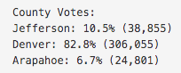
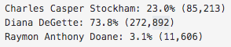
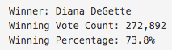

# election-analysis

## Overview of Election Audit
The purpose of this project was to assist a Colorado Board of Elections employee with retrieving specified information from a large data set of local election results. Referencing the .csv file of election results, I was to write a Python script which would allow me to retreive the following information and print it to a .txt file to for easy distribution:

1. Calculate the total number of votes cast
2. Calculate the total votes cast within each county represented in the data set
3. Determine the county with the highest number of votes cast
4. Pull a complete list of the candidates who received votes
5. Calculate the total number of votes each candidate received
6. From that vote total, calculate the percentage of the total votes each candidate received
7. Determine the winner of the popular vote from this election data

## Election Audit Results
My analysis of the election results data showed that:
  - 369,711 total votes were cast in this election
  - The 3 counties represented in this data set represented the following percentages of the overall vote:
          
    
  - The county with the largest voter turnout was Denver
  - 3 candidates were represented in the data set, and they received the following percentage of the total vote:
          
    
  - Diana DeGette won the election with these results:
          
    
          
## Election Audit Code
To retrieve this information from the election results data set, I first wrote a command to load the .csv file for the code to pull from. Then, I initialized the a vote_counter variable to zero and created lists and dictionaries for county voter data as well as candidate voter data:
```
# Initialize a total vote counter.
total_votes = 0

# Candidate Options and candidate votes.
candidate_options = []
candidate_votes = {}

# Create a county list and county votes dictionary.
county_list = []
county_votes = {}
```
The next step was to set the variables to populate the winning candidate and largest county voter turnout information:
```
# Track the winning candidate, vote count and percentage
winning_candidate = ""
winning_count = 0
winning_percentage = 0

# Track the largest county and county voter turnout.
largest_county = ""
largest_voter_turnout = 0 
```
With these variables set, I created a for loop to read each row in the .csv file and for each row, add to the total vote count. While the loop continued through each row, it also pulled the county name and candidate name from each row. For each new instance of a candidate, the script would append the candidate name to the candidate_options dictionary and track that candidate's vote count. The same code was written to track each new instance of a county:
```
# If the candidate does not match any existing candidate add it to
        # the candidate list
        if candidate_name not in candidate_options:

            # Add the candidate name to the candidate list.
            candidate_options.append(candidate_name)

            # And begin tracking that candidate's voter count.
            candidate_votes[candidate_name] = 0

        # Add a vote to that candidate's count
        candidate_votes[candidate_name] += 1

        # Write an if statement that checks that the
        # county does not match any existing county in the county list.
        if county_name not in county_list:

            # Add the existing county to the list of counties.
            county_list.append(county_name)

            # Begin tracking the county's vote count.
            county_votes[county_name] = 0

        # Add a vote to that county's vote count.
        county_votes[county_name] += 1
```

Once the loop was completed, the code then printed the candidate and county results along with their total percentage of the overall vote. This information was then saved to a .txt file which was created to save the output of the Python script.
          
## Election Audit Summary
Based on the outcome of this script, it was determined that this code could be utilized with some modifications for any election. 
#### Modifying for a National Election
While the original code was written for a local election, the code could easily be modified for use during a national election. Rather than tracking county results, that variable could be replaced by the voter's state. Then, each instance of "county" variables within the code could be modified to "state" variables.
#### Modifying for Election Types With More Than One Winner
The original code determined the single winning candidate based on the majority of the overall vote. For elections in which multiple candidates win, like with State Representative races, the code could be ammended to show not a single winner but rather the winning candidate by district. The code which displayed the total votes per county could be updated to show the total votes per candidate per disctrict.
